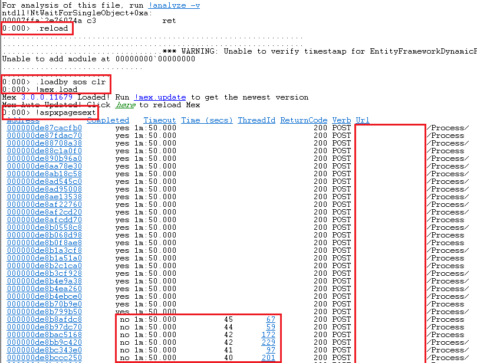
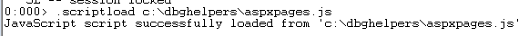
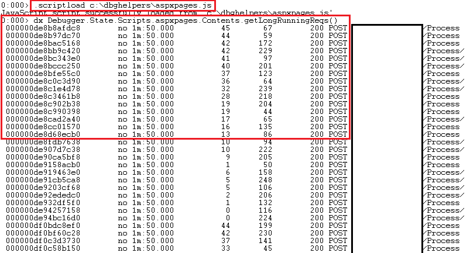

# windbg
Productive scripts for WinDbg

This repo was created to help debuggers to give them important tips while they are troubleshooting a problem.

[MEX](https://www.microsoft.com/en-us/download/details.aspx?id=53304) extention is a great library to find the problem's rootcause.
***aspxpages.js*** file can be used for listing long running requests in user mode dumps.
Script uses `!aspxpagesext` MEX library command and filters output as continued requests.

To be able to run the script please foolow the steps below in WinDbg editor command window:

1. Load initial libraries by using:
```js
.reload
```
2. Load related CLR library for .Net 4.x by using: 
```js
.load by sos clr
```
or .Net 2.x by using:
```js
.loadby sos mscorwks
```


3. Load custom script from your local repository (i.e. c:\dbghelpers) to the WinDbg repository by using:
```js
.scriptload c:\dbghelpers\aspxpages.js
```

4. Run the script
```js
dx Debugger.State.Scripts.aspxpages.Contents.getLongRunningReqs()
```

# References

[Customizing Debugger Output Using DML](https://docs.microsoft.com/en-us/windows-hardware/drivers/debugger/customizing-debugger-output-using-dml)

[JavaScript Debugger Scripting](https://docs.microsoft.com/en-us/windows-hardware/drivers/debugger/javascript-debugger-scripting)

[JavaScript basics](https://developer.mozilla.org/en-US/docs/Learn/Getting_started_with_the_web/JavaScript_basics)

[JScript Language Tour](https://docs.microsoft.com/en-us/previous-versions/visualstudio/visual-studio-2010/t895bwkh(v=vs.100))

[ECMAScript New Features](http://es6-features.org/)
